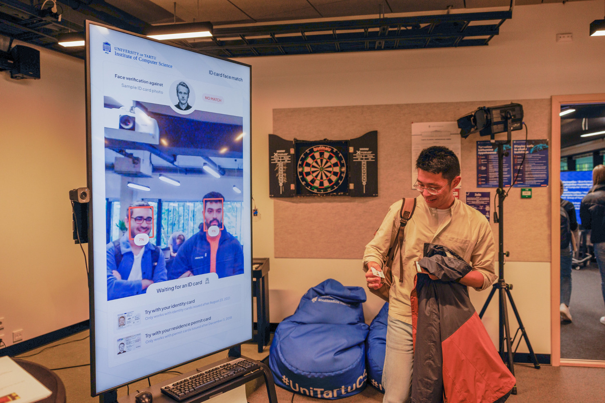

<!--
 Copyright (c) 2021 Burak Can
 Copyright (c) 2022 ACS research group, Institute of Computer Science, University of Tartu

 This software is released under the MIT License.
 https://opensource.org/licenses/MIT
-->

# ID card face match: Biometric facial verification using authentic ID card facial image



**ID card face match** is an interactive solution that demonstrates state-of-the-art face recognition technology and the capabilities of Electronic Machine Readable Travel Documents (eMRTD).

The solution compares faces visible to a camera with the authentic facial image of a cardholder stored on the Estonian ID card.

The cardholder's facial image is retrieved from the ICAO e-passport ([eMRTD](https://www.icao.int/publications/pages/publication.aspx?docnum=9303)) applet stored in the contact chip of the latest generation Estonian ID cards.
Cryptographic checks are performed to verify the authenticity of the ID card's chip and the information retrieved (cardholder's name and facial image). The [BAC](https://en.wikipedia.org/wiki/Basic_access_control) key (used to read data from the eMRTD applet) is derived from the information stored in the personal data file of the ID card's eID applet.

When faces are detected in the input from the camera, a similarity score is calculated against the reference facial image and displayed under the detected face.
Faces are considered a match if the euclidean distance between the face vectors is 0.5 or less (percentage > 50%).

Without an ID card inserted, the facial matching is performed against the sample Estonian ID card photo containing the facial image of [Mikk Kirikal](https://menu.err.ee/294106/id-kaardi-uus-nagu-modellina-ma-karjaari-tegema-ei-hakka).

The **face detection** uses a deep-learning-based face detection [model](https://github.com/opencv/opencv_3rdparty/blob/dnn_samples_face_detector_20180205_fp16/README.md) from [OpenCV's DNN](https://docs.opencv.org/5.x/d6/d0f/group__dnn.html) module. <!-- The DNN face detector is based on the Single Shot Detector (SSD) framework using a ResNet-10 like base network. -->

The **face verification** relies on [dlib](http://dlib.net/)'s face recognition library. The [model](https://github.com/davisking/dlib-models) used by the library was trained on a dataset of about 3 million faces and has an accuracy of 99.38%.


This software is based on the [eMRTD face access](https://github.com/Fethbita/eMRTD_face_access/) software developed by the Cyber Security MSc student [Burak Can Kus](https://burakcankus.com/) (University of Tartu) in the scope of his MSc [thesis](https://comserv.cs.ut.ee/ati_thesis/datasheet.php?id=72515&year=2021&language=en).

## Supported ID cards
* Estonian identity card (issued after August 23, 2021). Older cards are not shipped with eMRTD applet.
* Estonian residence permit card (issued after December 12, 2018). Older cards contain eMRTD applet on a separate contactless chip.
* Latvian eID card (issued after September 2, 2019). Older cards contain eMRTD applet on a separate contactless chip.

## Requirements
* Ubuntu 22.04
* Smart card reader
* Webcam
* NVIDIA GPU graphics card (for faster frame rate)

## In action


## Installation (on Ubuntu 22.04)
```shell
sudo apt install build-essential cmake python3-venv python3-dev libpcsclite-dev libssl-dev pcscd v4l-utils git swig pcsc-tools libopenblas-dev liblapack-dev

sudo systemctl enable pcscd
sudo systemctl enable pcscd.socket
sudo /etc/init.d/pcscd start

git clone https://github.com/acs-unitartucs/idcard_face_match.git
cd idcard_face_match
# Create virtualenv named '.venv'
python3 -m venv .venv
# Activate virtualenv
source .venv/bin/activate
# Upgrade pip
pip3 install --upgrade pip
pip3 install -r requirements.txt
```

## Running

Before running, make sure the virtual environment is activated with:
```shell
source .venv/bin/activate
```
The main program can be started by running the module:
```shell
python3 -m idcard_face_match
```

## Usage
```
usage: __main__.py [-h] [--output OUTPUT] [--camera CAMERA] [--camera-resolution CAMERA_RESOLUTION] [--camera-rotate CAMERA_ROTATE] [--camera-size CAMERA_SIZE] [--screen-width SCREEN_WIDTH] [--fullscreen] [--show-fps]

Biometric facial verification using authentic ID card facial image

options:
  -h, --help            show this help message and exit
  --output OUTPUT, --o OUTPUT
                        Directory to save eMRTD data files
  --camera CAMERA       Device ID of the camera to be used (e.g., 0 will use /dev/video0). The default is 0.
  --camera-resolution CAMERA_RESOLUTION
                        Camera input resolution (for 'MJPG' image format).
                        Resolutions supported by camera can be listed using the command:
                          v4l2-ctl -D -d /dev/video0 --list-formats-ext | grep -A 100 MJPG
                        If no resolution is provided, the default resolution of the camera will be used.
  --camera-rotate CAMERA_ROTATE
                        Degrees by which to rotate camera input clockwise (0, 90, 180, 270).
  --camera-size CAMERA_SIZE
                        Size (in percentage) of the camera input frame to use (the default is 100 - full frame).
  --screen-width SCREEN_WIDTH
                        Width component of the resolution for which to draw graphics.
                        The graphics use a fixed widescreen aspect ratio of 16:9 in portrait mode (9:16).
                        The graphics have been tested for resolutions:
                         - 1440 (1440x2560)
                         - 1080 (1080x1920)
                         - 720 (720x1280)
                         - 540 (540x960) - default
  --fullscreen          Run window in full screen mode. Press 'f' to toggle full screen mode. Press ESC to exit.
  --show-fps            Show FPS rate on the screen and log detailed timing measurements in console.
```

## GPU acceleration
CUDA-compatible NVIDIA graphics card can be used to speed up face verification and image processing.

To speed up face verification, `dlib` must be recompiled with CUDA support:

Install CUDA library:
```shell
sudo apt install nvidia-cudnn
sudo apt install nvidia-driver-510
reboot
```

Recompile `dlib` in the virtual environment:
```shell
source .venv/bin/activate
pip3 uninstall dlib
sudo apt install gcc-10 g++-10
export CC=/usr/bin/gcc-10
pip3 --verbose --no-cache-dir install dlib
  -- Enabling CUDA support for dlib.  DLIB WILL USE CUDA, compute capabilities: 50
```

To speed up image processing, `cupy` (CUDA-accelerated NumPy library) must be installed:

Install `cupy` in the virtual environment:
```shell
source .venv/bin/activate
pip3 install cupy-cuda11x
```

CUDA usage is reported in the program output:
```shell
python3 -m idcard_face_match
[+] camera(): dlib with CUDA: True
[+] camera(): CUDA-enabled cupy: True
```

## Credits

* Arnis Parsovs: Concept, programming
* Burak Can Kus: Programming
* Geio Tischler: Design

This work has been carried out with financial support from:

* Estonian Ministry of Economic Affairs and Communications
* European Social Fund via "ICT programme" measure

© [Applied Cyber Security Group](https://acs.cs.ut.ee/), Institute of Computer Science, University of Tartu
